# AMPKAR Progress Report — March 4, 2026

## Completed This Week

### New models
- **Model 5 (MA beta)** and **Model 6 (MM beta)** implemented — completes the 2x2 comparison (MA/MM x alpha/beta)
- Beta models add betaCaMKK parameter (alpha models lack this)

### Multi-AMP binding stoichiometry
- All 4 models updated: AMP binding now uses [AMP]^3
- kOffAMP priors re-tuned to compensate for ~2500x effective rate reduction

### Prior elicitation
- Completed for all 4 models — prior predictive checks look reasonable

- [MA alpha](../results/param_est/prior_predictive/prior_pred_MA_nonessential_stats.pdf) | [MM alpha](../results/param_est/prior_predictive/prior_pred_MM_nonessential_stats.pdf) | [MA beta](../results/param_est/prior_predictive/prior_pred_MA_nonessential_phos_stats.pdf) | [MM beta](../results/param_est/prior_predictive/prior_pred_MM_nonessential_phos_stats.pdf)

### Time-dependent kGly
- Implemented `pulse_input`, `square_input`, `make_time_dep_kGly` in `utils.py`
- Ready for frequency/pulse stimulation simulations

---

## Inference Results

All three models ran with Pathfinder (joint WT + LKB1 KD, shared parameters).

### Model 3 — MA alpha (16 free params)

**Posterior predictives:**

| WT | LKB1 KD |
|----|---------|
| 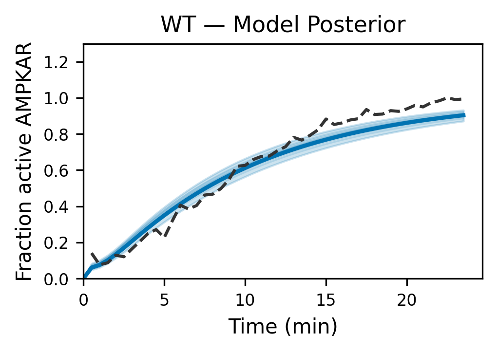 | 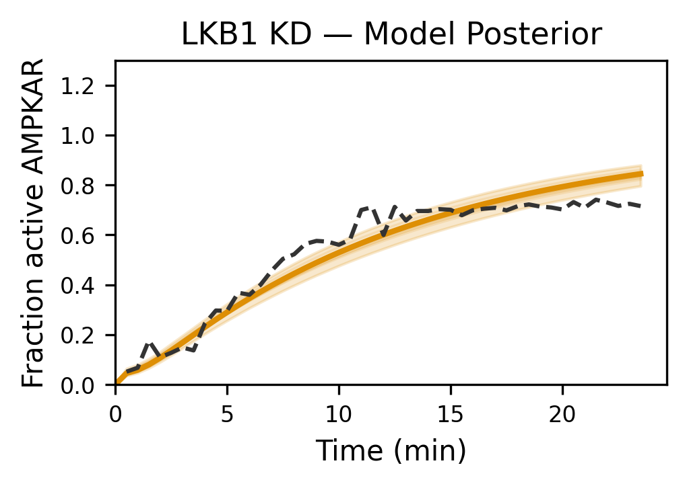 |

**Parameter marginals:**

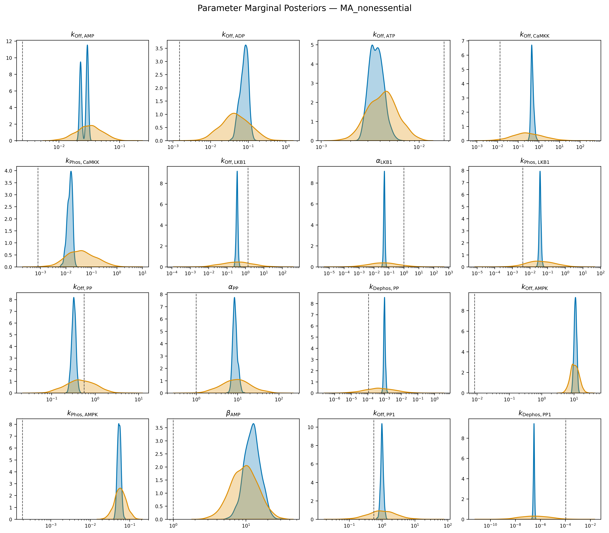

**Stimulus strength:**

| Max activation | Time to half-max |
|---------------|-----------------|
| 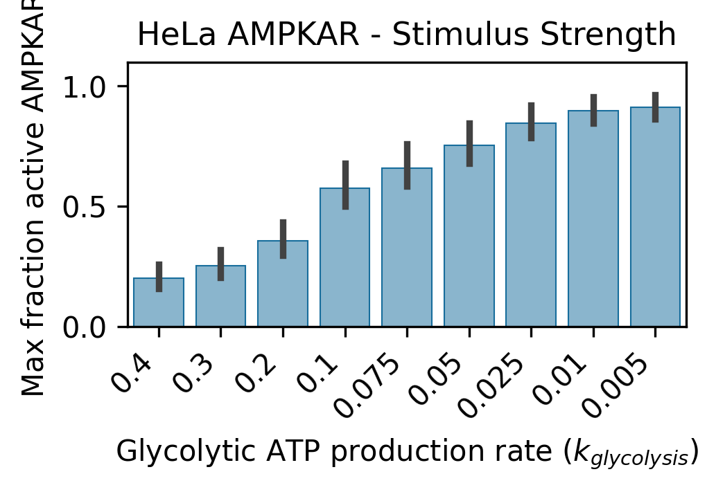 | 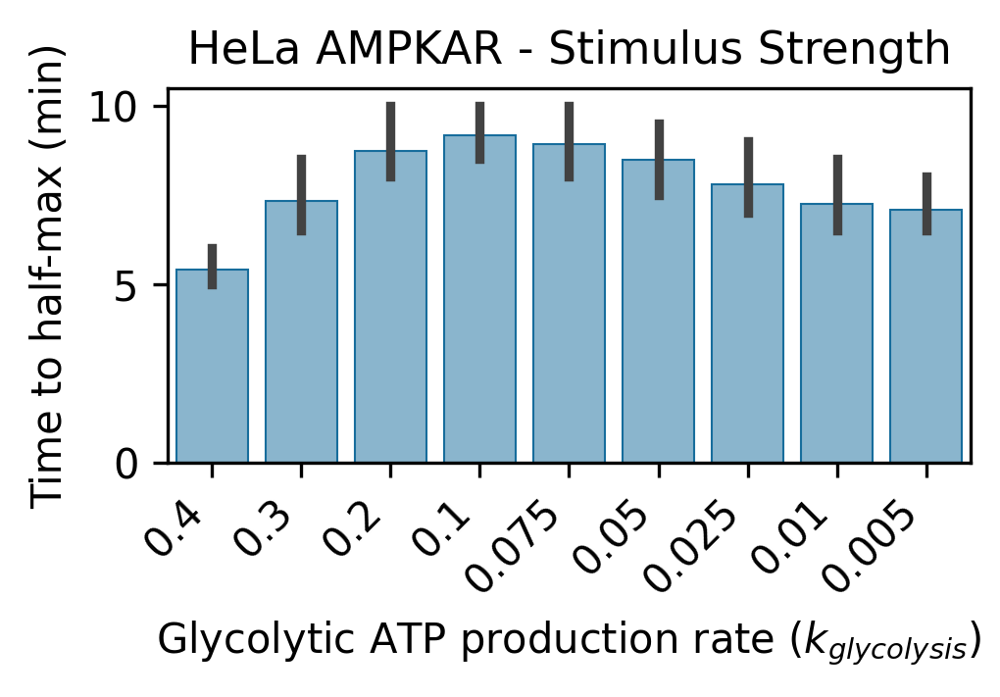 |

### Model 5 — MA beta (17 free params)

**Posterior predictives:**

| WT | LKB1 KD |
|----|---------|
| 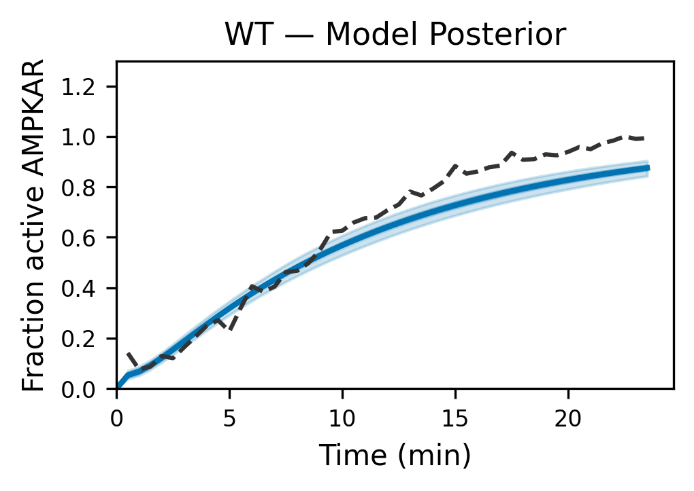 | 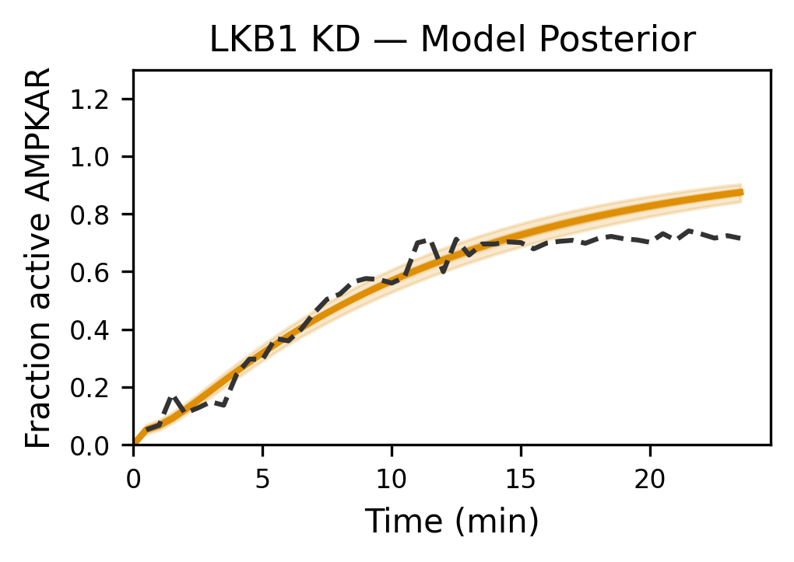 |

**Parameter marginals:**

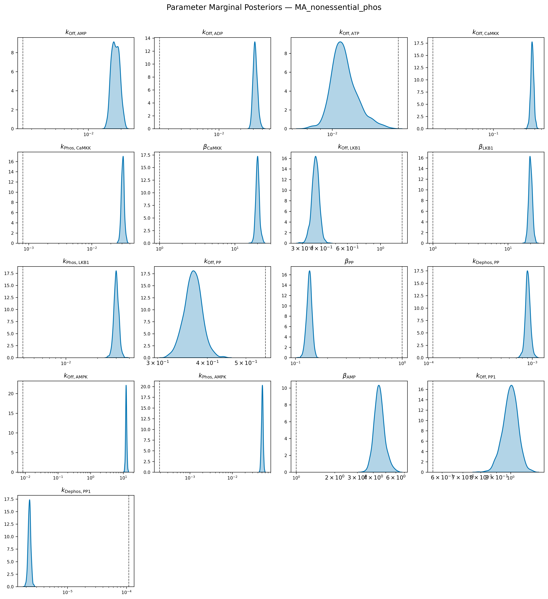

### Model 6 — MM beta (13 free params)

**Posterior predictives:**

| WT | LKB1 KD |
|----|---------|
| 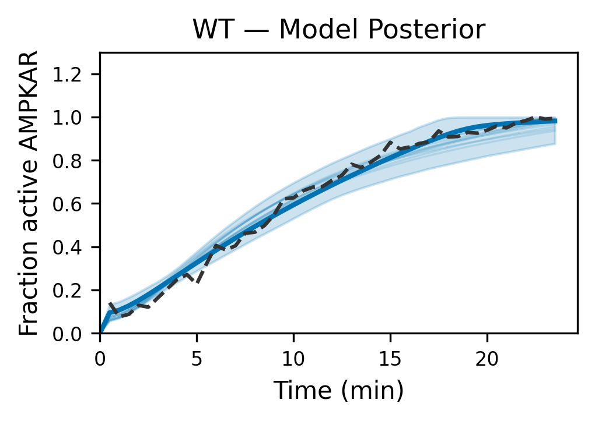 | 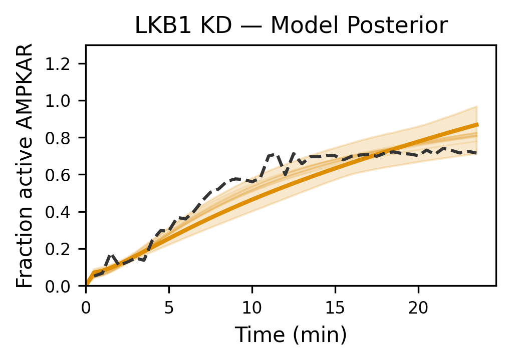 |

**Parameter marginals:**

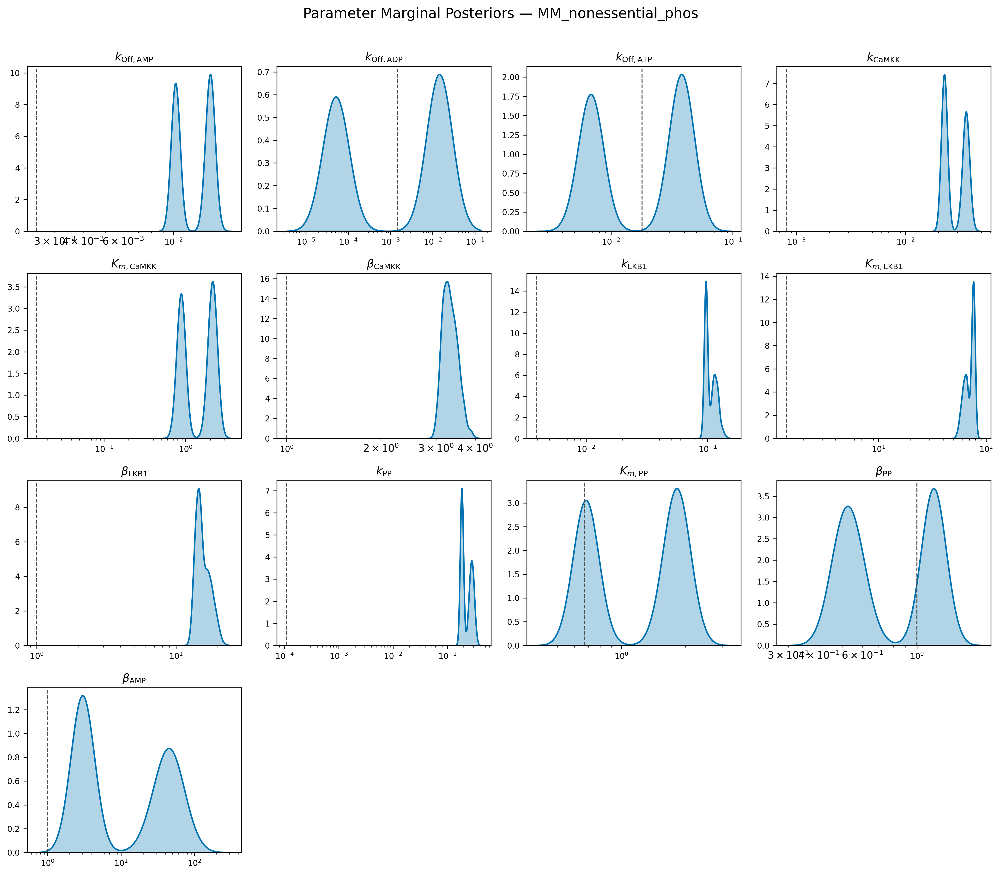

---

## Model Comparison (ELPD)

ELPD = Expected Log Pointwise Predictive Density via LOO cross-validation. Higher is better.

| Condition | MA alpha (Model 3) | MA beta (Model 5) | MM beta (Model 6) |
|-----------|-------------------|-------------------|-------------------|
| **WT** | 56.27 +/- 3.78 | 50.44 +/- 4.53 | **62.88 +/- 2.35** |
| **LKB1 KO** | **58.41 +/- 5.94** | 52.58 +/- 6.69 | 23.80 +/- 8.70 |

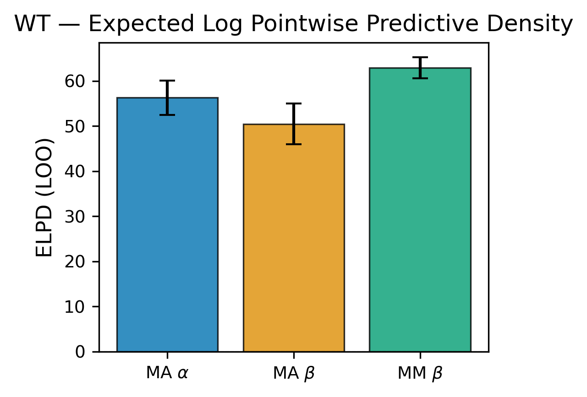
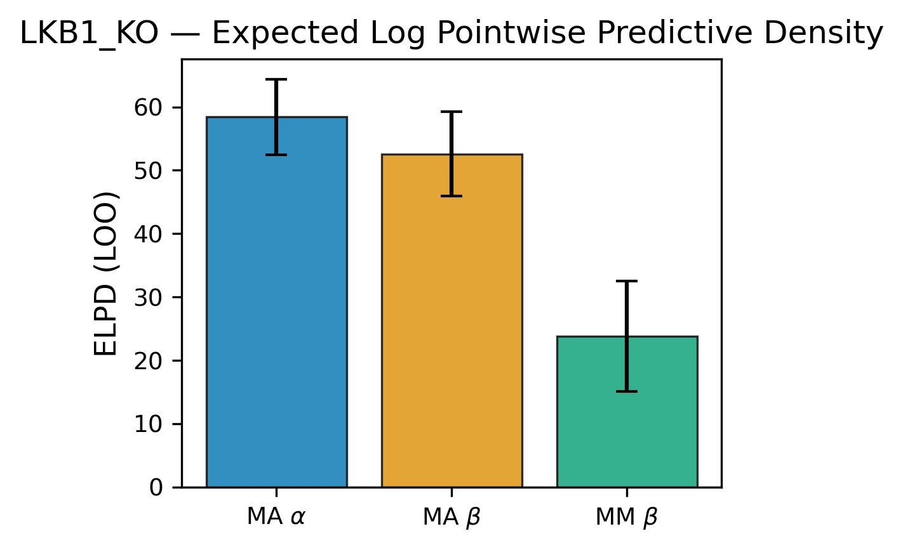
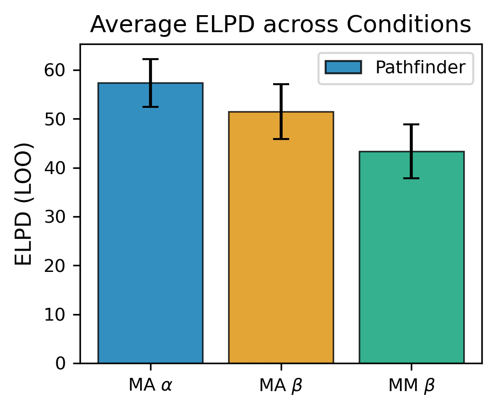

**Summary:**

- **MM beta (Model 6)** has the best WT fit (ELPD=62.9) but collapses on LKB1 KO (ELPD=23.8). Its p_loo=27.6 far exceeds the 13 free parameters, indicating severe overfitting in the LKB1 KO condition. Several parameters are poorly identified (betaAMP 90% CI: 2.5–69.6; kOffADP spans 4 orders of magnitude).
- **MA alpha (Model 3)** is the most consistent across both conditions and has well-identified parameters with tight posteriors. Ranks 1st on LKB1 KO with all model weight.
- **MA beta (Model 5)** ranks last in both conditions despite having the tightest posteriors overall. The beta parameterization (betaCaMKK~20, betaLKB1~20, betaPP~0.13) is well-identified but the model is less flexible than the alpha parameterization.
- **Overall winner: MA alpha (Model 3)** — best balance of predictive accuracy and parameter identifiability across both conditions.

---

## To Do

- **Frequency/pulse simulations** — infrastructure ready (time-dep kGly), not yet run
- **Stimulus strength predictions** for beta models (Models 5 & 6)
- **Calcium-CaMKK2 module** implementation (design doc exists)
- Run **Model 4 (MM alpha)** inference for complete 2x2 comparison

---

## Discussion Points for Nate Meeting

- **Prior elicitation**: He used `pz.predictive_explorer` — what was his actual workflow for tuning so many parameters? Systematic or trial-and-error?
- **Sensitivity analysis**: Which parameters drove the most output variance (Sobol)? Did results inform which to fix vs fit? Any significant parameter interactions? (check paper)
- **PP1**: Why a separate phosphatase for AMPKAR? Is this a modeling consideration or any source he found suggested this? 
- **Shared vs independent inference**: Which worked better for his 3-condition case? Which one did he end up using? I couldn't get the independent one to work, but a partial independent model could be useful for modelling/capturing LKB1 arm?
- **AMP binding**: Did he consider multi-site binding?
- **Stimulation**: Is kGly the only parameter tuned for simulation? (check paper)
- **Computation**: Did NUTS/ADVI work for him? I only have meaningful results from Pathfinder, which is also his final choice. Any tips for Pathfinder parameter choice?
- **CaMKK2**: The paper's supplementary has calcium-dependent CaMKK2 equations, but his repo has no implementation — CaMKK is treated as constitutive in all models. Was this explored and abandoned, or left for future work?
